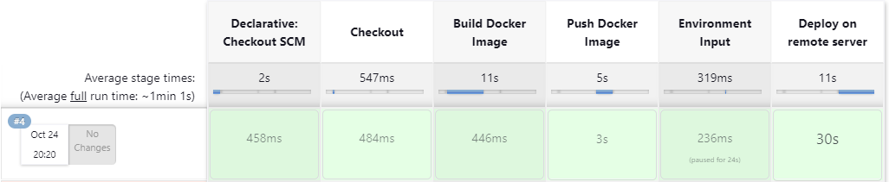

# Jenkinsfile

The Jenkins file is supposed to be running on an agent called ***slave1*** (or alternatively on the master, if preferred).

And it contain 5 stages:

# 1 - Checkout:
This stage involves checking out the source code from the version control system using the checkout scm command. 

# 2 - Build Docker Image:

In this stage, the script builds a Docker image using the Dockerfile present in the repository. It uses the commit hash as the tag for the Docker image.

# 3 - Push Docker Image:

This stage is responsible for pushing the Docker image to a Docker registry (in this case, DockerHub). It first logs in to the DockerHub repository using the provided credentials ***(DOCKERHUB_ID)*** which is username and password existing on jenkins server. Then, it tags the Docker image with a specific version, and finally pushes it to the DockerHub repository.

# 4 - Environment Input:

This stage collects user input to set up environment variables for the deployment process. It prompts the user to provide specific information, such as:
 - The app server IP.
 - RDS hostname.
 - RDS username.
 - RDS password.
 - RDS port.
 - Redis hostname.
 - Redis port.
 > Both RDS username and RDS password passed by terraform.tfvars.
 

# 5 - Deploy on Remote Server:

This stage is responsible for deploying the Docker image on a remote server. It utilizes SSH to connect to the specified app server and execute Docker-related commands. It pulls the previously pushed Docker image from the DockerHub repository and runs with provided environment variables. 
