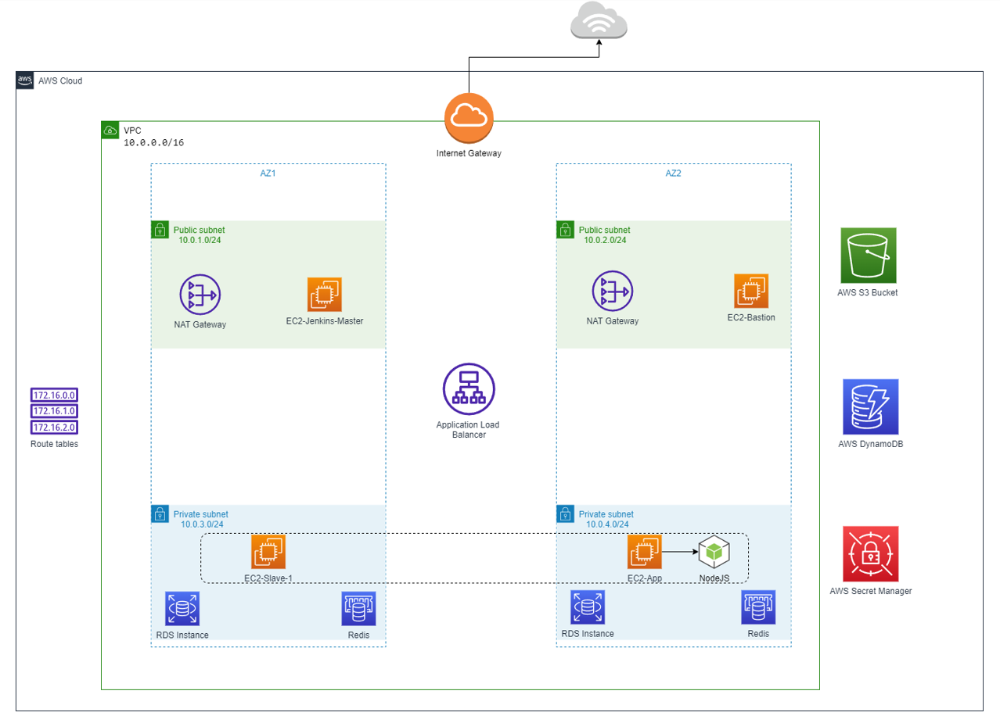
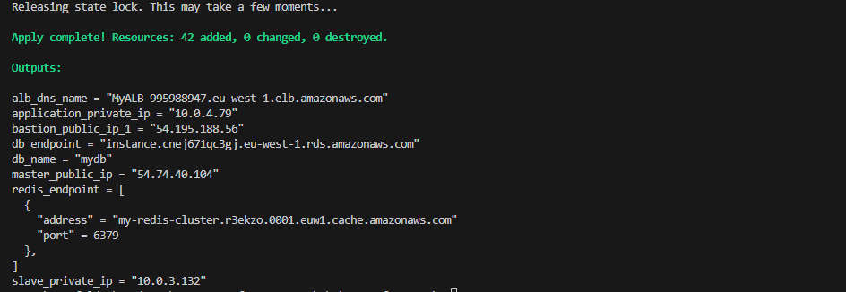
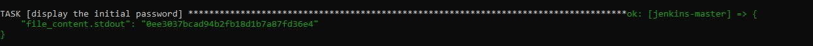

# Build and Deploy NodeJS app with AWS Integration
This is a demo project showcasing the process of building and deploying a NodeJS application on AWS. The application connects to AWS RDS MySQL database and utilizes AWS ElasticCache Redis for enhanced performance and scalability.




---
## Infrastructure 
I utilized AWS resources for deploying and running the application. The infrastructure was set up as follows:

1. Isolated Virtual Private Cloud (VPC): A dedicated and isolated VPC was established to ensure secure networking and resource isolation.
2. AWS Instances: Four servers were provisioned to handle application building and deployment process.
3. AWS ALB: Incorporated AWS Application Load Balancer (ALB) to facilitate access to the application within the private server environment
4. AWS RDS with MySQL: An AWS Relational Database Service (RDS) instance of MySQL type was employed to manage the application's database requirements effectively.
5. AWS ElasticCache Redis: ElasticCache Redis was utilized to enhance the application's performance and ensure efficient caching of frequently accessed data.
6. AWS DynamoDB and S3 Bucket for Backend: Utilized DynamoDB for Terraform locking and S3 for storing the state file, ensuring secure and scalable infrastructure management.
7. AWS Secret Manager: Integrated it to securely store SSH keys utilized for accessing the instances, ensuring robust access control and enhancing overall security measures.
   
> For more details about the infrastructure, you can navigate to [README.md](./terraform/README.md).


## Docker Integration
Implemented containerization and pushed the Docker image for the application to a private DockerHub repository, ensuring secure and efficient management of the application's containers.

## Jenkins 
Implemented Jenkins for Continuous Integration and Continuous Deployment (CI/CD) to ensure a streamlined and efficient software development and delivery process. [Pipeline Image](https://prnt.sc/2rERqveJyS0o)

> For more details about jenkisn pipeline stages, you can navigate to [README.md](./Jenkins/README.md).


## Ansible
Utilized Ansible for setting up and managing configurations across our servers, ensuring efficient and reliable configuration management.

---
## Getting Started
To begin, follow these steps:

- Create a ***DynamoDB*** table and an ***S3 bucket*** for terraform backend.
- Clone the project's rds_redis branch.
- Provision the infrastructure using the command `terraform apply --auto-approve`. The expected output is shown below:

- Update the /.ssh/config file with the values provided to enable Ansible to configure the private instance:

    ```
    Host bastion-1
        HostName <bastion-ip>
        User ubuntu
        IdentityFile <path-to-key_1.pem>

    Host app
        HostName <app-private-ip>
        User ubuntu
        IdentityFile <path-to-key_1.pem>
        ProxyJump bastion-1

    Host jenkins-master
        HostName <master-ip>
        User ubuntu
        IdentityFile <path-to-key_2.pem>

    Host jenkins-slave
        HostName <slave-private-ip>
        User ubuntu
        IdentityFile <path-to-key_2.pem>
        ProxyJump jenkins-master 
    ```

- Test the functionality of the proxy jump by checking the SSH connection for the private instance with the following commands:
    ```
    ssh app
    ssh jenkins-slave
    ```
> If you successfully connect to both private instances, your configuration settings are accurate. If not, review the /.ssh/config file and ensure the correct path for the private keys.

- Modify inventroy file inside ***ansible*** folder with path of poth keys
- Test the connection of severs inside invetory by running:
    ```
    ansible -i inventory -m ping jenkins-master
    
    ansible -i inventory -m ping jenkins-slave

    ansible -i inventory -m ping app
    ```

> If you successfully ping to the three servers, your configuration settings are accurate. If not, check again both /.ssh/config and /ansible/inventory files and ensure the correct path for the private keys.


- Configure the three servers by navigating to the ***ansible*** folder and executing the following commands:  
    ```
    ansible-playbook -i inventroy setup_master_instance.yaml --extra-vars "master_ip=<master_ip>"
    
    ansible-playbook -i inventroy setup_slave_instance.yaml
    
    ansible-playbook -i inventroy setup_app_instance.yaml
    ```

> Upon completion of these steps, all the required configurations for running Jenkins, Docker, and creating or modifying specific files will be in place.

- Copy the initialPassword provided after successfully configuring the jenkins-master playbook.
    

- Navigate to http://<master_ip>:8080/ and set up the Jenkins GUI, and do following steps:
    1. Install ***SSH Agent** plugin.
    
    2. Add credentials for the Docker private repository ***(username and password)***.
       [DockerHub Credentials](https://prnt.sc/0e8cR18PSkvr)

    3. Add credentails for slave server ***(ssh and private key)***.
       [Slave Credentials Image](https://prnt.sc/cQjqdiQpCfCg)

    4. Configure node to launch agent using ***execution of command on the controlle*** or ***SSH***.
       [Slave Configuringn Image](https://prnt.sc/6e3nz6sHRcnD)
       
        > in case of using ssh for connection, you have to ***uncomment*** couble of blocks in ***setup_slave_instance.yaml*** , either way you can curl agent.jar and connecting it by executing certain commands. Follow this  [Connect Jenkins Slave to  the Master](https://medium.com/@DevOpsfreak/how-to-configure-jenkins-slave-nodes-by-launching-agents-via-ssh-or-launch-agent-via-execution-of-a0cf6d6dd032) for more info

- After successfully launching and connecting the agent to the master, configure a new pipeline run on slave server and start the application's build and deployment process.
       [Pipeline Configuration Image](https://prnt.sc/-FChTqXDGpk1)

- While deploying the application through the Jenkins stage, you will be prompted to enter certain required environment variables necessary for running the Docker container. Ensure that you fill them with the correct values.
       [Input Stage Image](https://prnt.sc/rUK4d4Mr4qKA)

- Test the application by navigating to the ***http://<alb_dns>/db*** and ***http://<alb_dns>/redis***.
    > Upon visiting /db, you should see a message that says ***db connection successful***, and when navigating to /redis, you should see  ***redis is successfuly connected***.

## Clear up
- To clear up or delete all AWS resources provisioned using Terraform, you can use the `terraform destroy --auto-approve`, This command will destroy all the resources defined within your Terraform configuration.


